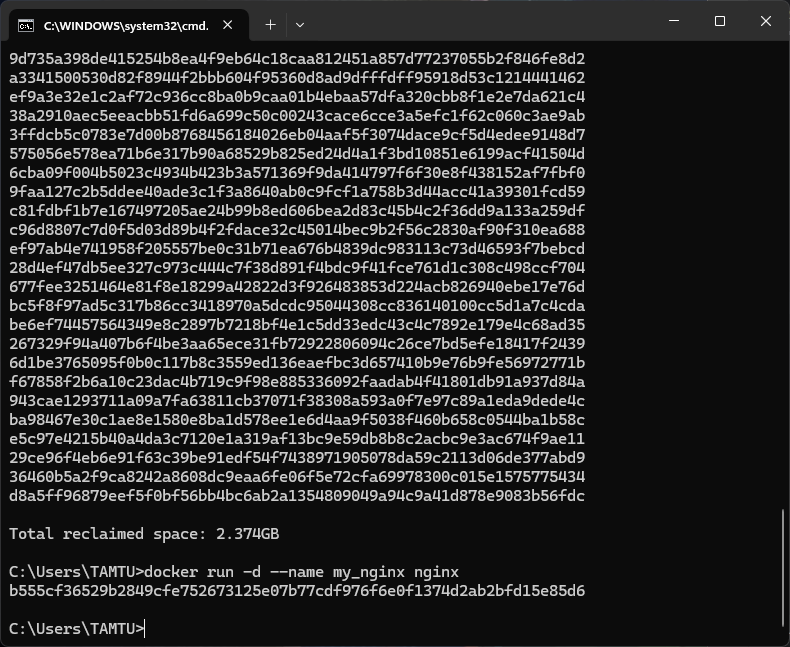

# Nguyễn Tâm Tú - 21081521

## 1. Kiểm tra phiên bản Docker
```
docker --version
```
Docker sẽ hiển thị phiên bản hiện tại nếu đã được cài đặt thành công.

---
## 2. Chạy thử một container mẫu
```
docker run hello-world
```
Chạy container `hello-world`, kiểm tra xem Docker có hoạt động bình thường không.

---
## 3. Tải image từ Docker Hub
```
docker pull nginx
```
Tải image `nginx` từ Docker Hub về máy.

---
## 4. Hiển thị danh sách images
```
docker images
```
Xem danh sách các images đã tải về máy.

---
## 5. Chạy container ở chế độ nền
```
docker run -d nginx
```
Chạy container từ image `nginx` trong chế độ nền (detached mode).

---
## 6. Xem danh sách container đang chạy
```
docker ps
```
Hiển thị các container đang chạy.


---
## 7. Xem danh sách tất cả container
```
docker ps -a
```
Liệt kê tất cả container, bao gồm cả những container đã dừng.

---
## 8. Xem logs của container
```
docker logs <container_id>
```
Xem log hoạt động của container.

---
## 9. Truy cập vào bên trong container
```
docker exec -it <container_id> /bin/sh
```
Mở terminal trong container để thực hiện các lệnh bên trong.

---
## 10. Dừng container
```
docker stop <container_id>
```
Dừng một container đang chạy.

---
## 11. Khởi động lại container
```
docker restart <container_id>
```
Khởi động lại container.

---
## 12. Xóa container
```
docker rm <container_id>
```
Xóa container đã dừng.

---
## 13. Xóa tất cả container đã dừng
```
docker container prune
```
Xóa tất cả container không còn sử dụng.

---
## 14. Xóa image
```
docker rmi <image_id>
```
Xóa một image khỏi hệ thống.

---
## 15. Xóa tất cả images không sử dụng
```
docker image prune -a
```
Dọn dẹp tất cả images không sử dụng.

---
## 16. Chạy container và ánh xạ cổng
```
docker run -d -p 8080:80 nginx
```
Chạy `nginx` và ánh xạ cổng 8080 của máy chủ với cổng 80 của container.


---
## 17. Xem thông tin container
```
docker inspect <container_id>
```
Hiển thị thông tin chi tiết của container.

---
## 18. Gắn volume vào container
```
docker run -d -v mydata:/data nginx
```
Gắn volume `mydata` vào container tại `/data`.

---
## 19. Liệt kê các volumes
```
docker volume ls
```
Hiển thị danh sách các volumes có trong hệ thống.


---
## 20. Xóa các volumes không sử dụng
```
docker volume prune
```
Dọn dẹp tất cả volumes không còn được sử dụng.

---
## 21. Chạy container với tên cụ thể
```
docker run -d --name my_nginx nginx
```
Tạo container `nginx` với tên `my_nginx`.

---
## 22. Theo dõi tài nguyên của container
```
docker stats
```
Xem thông tin tài nguyên (CPU, RAM, I/O) của các container đang chạy.

---
## 23. Liệt kê các mạng Docker
```
docker network ls
```
Hiển thị danh sách mạng trong Docker.

---
## 24. Tạo mạng Docker mới
```
docker network create my_network
```
Tạo một mạng Docker có tên `my_network`.

---
## 25. Chạy container trong một mạng cụ thể
```
docker run -d --network my_network --name my_container nginx
```
Chạy container `nginx` trong mạng `my_network`.

---
## 26. Kết nối container với mạng Docker
```
docker network connect my_network my_nginx
```
Kết nối container `my_nginx` vào mạng `my_network`.

---
## 27. Chạy container với biến môi trường
```
docker run -d -e MY_ENV=hello_world nginx
```
Tạo container với biến môi trường `MY_ENV` có giá trị `hello_world`.

---
## 28. Theo dõi logs của container
```
docker logs -f my_nginx
```
Theo dõi log của container `my_nginx` theo thời gian thực.

---
## 29. Viết Dockerfile
```
FROM nginx
COPY index.html /usr/share/nginx/html/index.html
```
Tạo một Dockerfile để build một image mới với file `index.html`.

---
## 30. Build image từ Dockerfile
```
docker build -t my_nginx_image .
```
Build một image mới có tên `my_nginx_image` từ Dockerfile.

---
## 31. Chạy container từ image đã build
```
docker run -d -p 8080:80 my_nginx_image
```
Chạy container từ image `my_nginx_image` và ánh xạ cổng 8080.


---

